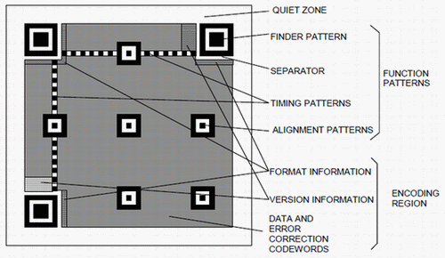

# QR Code Generator

QR (Quick Response) code generator for URLs

## Configuration Used
- <b>QR Code version used: 4</b> (Page 33 of resources/ISO IEC 18004 2015 Standard.pdf); 33 modules
- Using Byte Mode; 0100

## Encoding Modes
- numeric: [0-9]; Mode Indicator: 0001
- alphanumeric: [0-9A-Z$, %, *, +, -, ., /,:,\s]; Mode Indicator: 0010
- byte: characters from the <a href='https://en.wikipedia.org/wiki/ISO/IEC_8859-1'>ISO-8859-1 character set</a>; Mode Indicator: 0100
- kanji: double byte character set from <a href='https://en.wikipedia.org/wiki/Shift_JIS'>Shift JIS char set</a>; Mode Indicator: 1000

## Error Correction Level
| Correction Level    | Correction Capability |
| -------- | ------- |
| L | Recovers 7% of data |
| M | $Recovers 15% of data |
| Q | Recovers 25% of data |
| H | Recovers 30% of data |

## Character Count indicator
| Version | Numeric mode | Alphanumeric mode | Byte mode | Kanji mode |
| --------| ------------ | ----------------- | --------- | ---------- |
| M4      | 6            | 5                 | 5         | 4          |

## QR code region and function patterns
- funnction patterns - finder, seperator; do not encode data
- timing patterns
- alignment patterns



### Finder Pattern
- Present in upper left, upper right, bottom left corners
- Concentric squares of dark 7x7 modules, light 5x5 modules and dark 3x3 modules
- Ratio of module width in each finder pattern is 1 : 1 : 3 : 1 : 1
- For position and rotation of QE

### Seperator
- One module seperator placed b/w finder pattern and encoding region

### Timing Patttern
- To determine version and symbol density and provide datum positions for determining module coordinates
- Alternating black and white modules; Starts and ends with black; Vertical and horizontal straight line

### Encoding Region
- Represents data, error correction, codewords, format information, version information

## Number of bits post encoding for Byte Mode
```
B = M + C + 8D
```
where:
- B: number of bits in bit stream
- M: number of bits in mode indicator = 4
- C: number of bits in character count indicator: 5 for V4 Byte Mode
- D: number of input data characters

## Error Correction
- <a href='https://en.wikipedia.org/wiki/Finite_field'>Galois Field</a> of order 256; GF(256)
    - Addition -> XOR
    - Multiplication -> Results in an element within GF(256)

#### Types of Errorneous Codewords
- Erasures: Erroneous codewords at known locations
- Errors: Erroneous codewords at unknown locations


#### Ref
- https://dev.to/maxart2501/let-s-develop-a-qr-code-generator-part-i-basic-concepts-510a
- https://codingchallenges.fyi/challenges/challenge-qr-generator/
- https://en.wikipedia.org/wiki/QR_code
- https://en.wikipedia.org/wiki/ISO/IEC_8859-1
- https://en.wikipedia.org/wiki/Reed%E2%80%93Solomon_error_correction